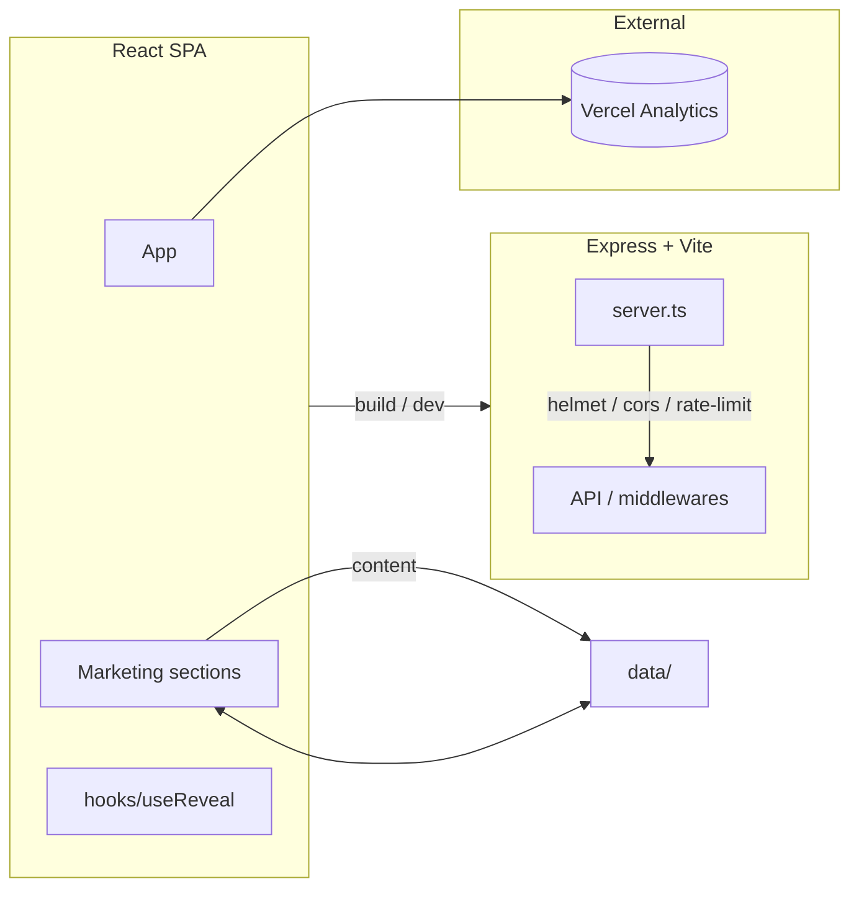

# eventive

> The online home for an upcoming Zimbabwe events company — elevates venues, services, and events with a modern, high-contrast design.


**eventive** is the marketing website for an upcoming Zimbabwe events company.
Built as a fast, accessible React SPA, it showcases venues, services, about /
manifesto content, and contact details — all driven by a small, type-safe data
layer so content is easy to edit without touching markup.

---

## Features

- **Hero + Manifesto** — on-brand opening sections.
- **Venues** — glass-frosted venue cards with an azure/clay two-colour system.
- **Services** — a clear, scannable services section.
- **About / Manifest** — company story and principles.
- **Contact** — contact section with form handling.
- **Accessibility** — WCAG-AA legibility baked into the design system.
- **Animations** — scroll-reveal hooks and motion flourishes.

---

## Tech Stack

| Layer | Technology |
| --- | --- |
| Frontend | React 18, Vite, TypeScript, Tailwind CSS 4 |
| Styling | Tailwind + `class-variance-authority` + `tailwind-merge` (`cn()` helper) |
| Icons / motion | Lucide React, `motion` |
| Server | Express + `tsx` (dev) / esbuild bundle (prod) |
| Backend safety | `helmet`, `cors`, `express-rate-limit` |
| Analytics | `@vercel/analytics` |
| AI (optional) | `@google/genai` |

---

## Architecture



The React SPA is built with Vite and served alongside a small Express server for
production. Content lives in `src/data/`, keeping sections declarative and easy
to update.

---

## Getting started

### Prerequisites

- Node.js 18+ (20+ recommended)
- npm

### Install & run

```bash
npm install
npm run dev
```

### Build & preview

```bash
npm run build       # client + server bundle
npm run preview     # preview the production build
npm start           # run the bundled server
```

### Quality checks

```bash
npm run lint          # ESLint
npm run type-check    # tsc --noEmit
npm run build:analyze # Vite bundle report
```

---

## Configuration

Server-side configuration is read from environment variables (see `server.ts`):

| Variable | Purpose |
| --- | --- |
| `GEMINI_API_KEY` | (Optional) Google Gemini API key for AI features. |
| `PORT` | Server port for production (`npm start`). |

Copy `.env.example`-style values into a local `.env` (gitignored) as needed. See
`DEPLOY`/`.env.example` files in the repo for the current set.

---

## Deployment

> **eventive is a live site.** This hardening pass does **not** modify any
> deployment configuration, `.cpanel.yml`, or the private registrar / NS setup.
> Existing CI workflows (e.g. Datadog Synthetics) are preserved and still run.

For a fresh production deployment of the client+server bundle:

```bash
npm ci
npm run build
NODE_ENV=production PORT=3000 npm start
```

---

## Folder structure

```
eventive/
├── src/
│   ├── main.tsx / App.tsx
│   ├── index.css
│   ├── data/            # venues.ts, manifests.ts (content layer)
│   ├── hooks/           # useReveal.ts
│   └── components/
│       └── marketing/   # Hero, Venues, Services, About, Manifest, Contact, Header, Footer
├── server.ts             # Express + Vite entry
├── vite.config.ts / tsconfig.json
├── .eslintrc.cjs
└── AUDIT.md
```

---

## Roadmap

- [x] Core marketing sections + WCCAG-AA design
- [x] Production build + server bundle
- [x] Datadog Synthetic monitoring
- [ ] Web UI screenshots
- [ ] Add render/smoke tests for sections
- [ ] Localise `preinstall` global `tsx` install
- [ ] Lighthouse / CSP hardening

---

## Contributing

See [CONTRIBUTING.md](./CONTRIBUTING.md), [CODE_OF_CONDUCT.md](./CODE_OF_CONDUCT.md),
and [SECURITY.md](./SECURITY.md).

## License

[MIT](./LICENSE) © 2026 YassinAliYassin
